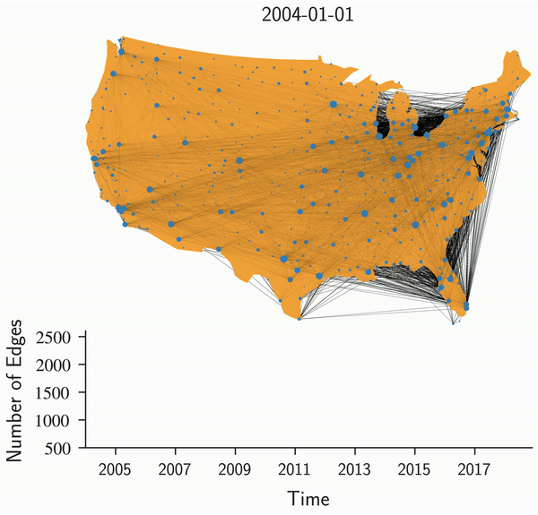

## Code for: Forecasting the evolution of fast-changing transportation networks using machine learning <br/>

This is the repository associated with the paper **"Forecasting the evolution of fast-changing transportation networks using machine learning" Nature Communications (2022)**<br/>



**Repository structure:** <br/>

* **data/** -- 
    * **raw_usair_data/** -- data folder to put raw US air transportation data (download at https://doi.org/10.21985/n2-9r77-p344)
    * **cleaned_brazilbus_data/** -- data folder to put raw Brazil bus transportation data (download at https://doi.org/10.21985/n2-9r77-p344)
    * **features/** -- data folder to put calculated topological features (running raw2features)
* **results/** -- data folder to put model output (running classification and longterm_prediction)
* **notebooks/** -- notebooks for visulizations 
* **src/** -- other supporting codes for analysis and visualization


**Steps:** <br/>

* **env.txt** -- create conda environment (```$ conda create --name <env> --file <this file> ```)
* **0_raw2features_usair.py** -- building feature matrix for the models(```$ python3  0_raw2features_usair.py```)
* **0_raw2features_brazilbus.py** -- building feature matrix for the models (```$ python3  0_raw2features_brazilbus.py```)
* **1_classification.py** -- running different models for results in **Fig.3, Fig.4, Fig.5** (```$ python3  1_classification.py```)
* **2_longterm_prediction.py** --  running long term prediction for results in **Fig.6a** (```$ python3  2_longterm_prediction.py```)
